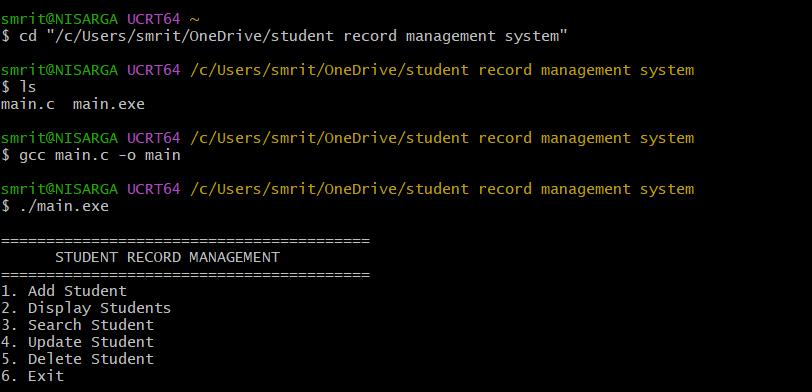
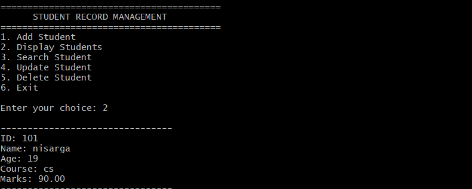
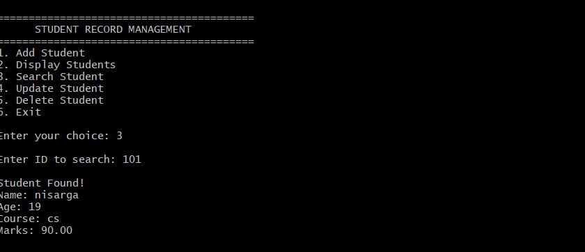
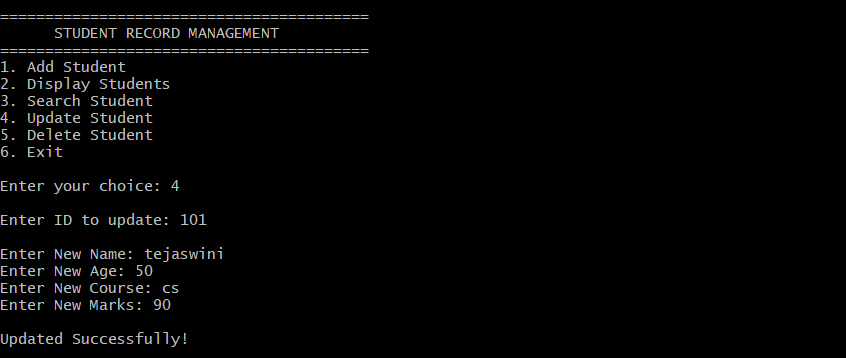
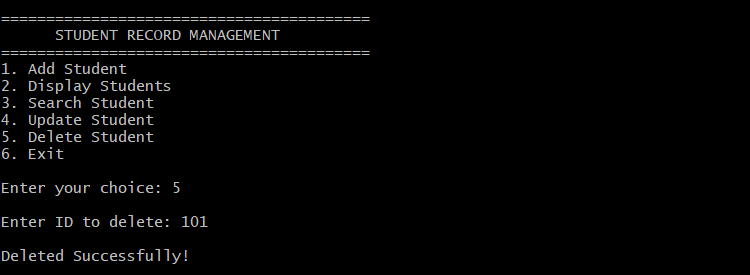

# 🎓 Student Record Management System (C)

A menu-driven **Student Record Management System** developed using the **C programming language**. This project demonstrates the use of structures, functions, arrays, loops, conditional statements, and file handling to efficiently manage student records.

---

## 📌 Features

* ➕ Add Student Record
* 📋 Display All Students
* 🔍 Search Student by ID
* ✏️ Update Student Details
* 🗑️ Delete Student Record
* 💾 Save Student Records to File
* 📂 Load Student Records Automatically
* 🖥️ Menu-Driven Console Application

---

## 🛠️ Technologies Used

* C Programming
* GCC Compiler (MSYS2 UCRT64)
* Visual Studio Code
* File Handling

---

## 📁 Project Structure

```text
Student-Record-Management-System/
│── main.c
│── students.txt
│── README.md
```

---

## 🚀 How to Run

### 1. Clone the repository

```bash
git clone https://github.com/YOUR_GITHUB_USERNAME/Student-Record-Management-System.git
```

### 2. Open the project folder

```bash
cd Student-Record-Management-System
```

### 3. Compile the program

```bash
gcc main.c -o main
```

### 4. Run the program

```bash
./main.exe
```

---

## 📸 Screenshots

### 🏠 Main Menu



### ➕ Add Student


### 📋 Display Students



### 🔍 Search Student



### ✏️ Update Student



### 🗑️ Delete Student




---

## 📚 Concepts Used

* Structures
* Functions
* Arrays
* Loops
* Conditional Statements
* File Handling
* User-defined Functions

---

## 🎯 Future Enhancements

* Search Student by Name
* Sort Students by Marks
* Sort Students by ID
* Login Authentication
* Input Validation
* Export Student Records to CSV

---

## 👨‍💻 Author

Nisarga Nayak

B.Tech (Networks)
